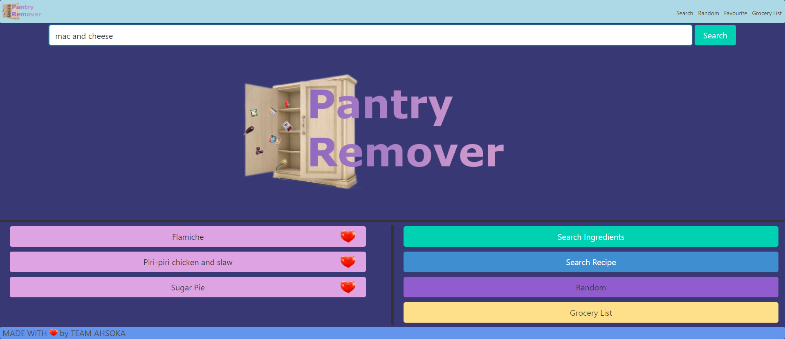

# ahsoka
## Purpose
To help people use their ingredients by providing recipes that match the available ingredients and have a list of of groceries for the ingredients they dont have.

## User Story
As a hungry person I want to find something to eat

As a person with some ingredients in the cupboard/fridge I want to search for what can be made with them and see a list of recipes

If I still need ingredients to complete a meal I want to easily be able to make a shopping list

As a person who goes shopping I want an interactive list i can use to help me keep track of what i need to buy

## Technologies 
We used: 
   * HTML 
   * CSS 
   * Bulma 
   * Javascript
   * Jquery
   * RapidAPI with two APIS
      *  https://rapidapi.com/thecocktaildb/api/themealdb/
        
      *  https://rapidapi.com/thecocktaildb/api/the-cocktail-db/

## Deployed Link
here is the link to the deployed project https://robgibson69.github.io/ahsoka/

## File links
to open [index.html](index.html) file to view the code

to open the screenshot here is the link [screenshot.png](assets/images/pantry-remover.png)

